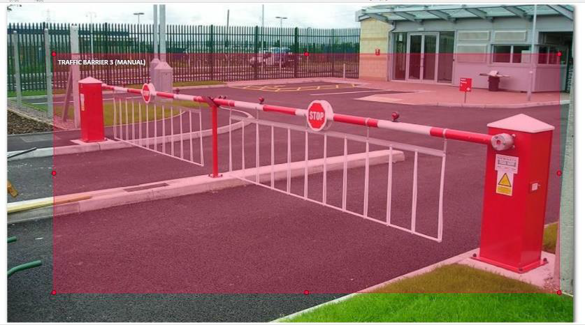
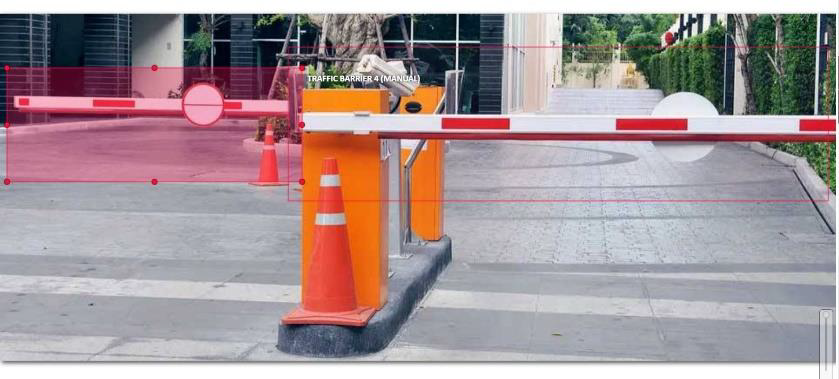
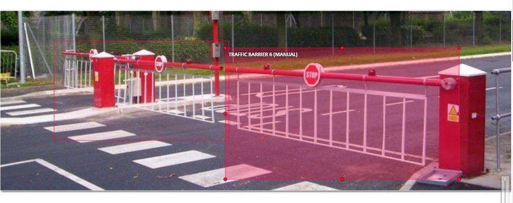

# AI Product Manager

## Udacity | Bertelsmann

# Capstone Project Proposal
# Create Traffic Barrier (Gate) Identification App

#### Aswin Vijayakumar

## Business Goals

### Project Overview and Goal

What is the industry problem you are trying to solve? Why use ML/AI in solving this task? Be as specific as you can when describing how ML/AI can provide value. For example, if you’re labeling images, how will this help the business?

#### Answer:

Create a Traffic Barrier (Gate) Identification App using a Traffic Barrier Dataset Dataset useful to be detected by cameras and IoT devices for use in Dashcams

Dashcams or IoT cameras will be able to identify traffic barriers from a Computer Vision or Deep Learning Model and inform the necessary interfaces for monitoring and surveillance such that autonomous cars and dashcams will know how to respond to situations. In a traffic barrier the driver is waiting for instructions, these instructions may be supplied to the autonomous car or truck when the driver reaches that point.
The business problem is a data centric problem where there should be fairness integrated into the ML/AI model in order to perform computation using Computer Vision techniques.

I need to annotate those images that actually portray a real traffic barrier placed on road temporarily or permanently.
The ML/AI Project can deliver success by addressing biases such as model bias, data bias and annotation bias. Traffic barriers are required to have specific requirements for identification, so the dataset created here prioritizes the annotation of those traffic barriers that does absolutely reflect the most probable appearance and helps in detection of such physical entities on road.

### Business Case

Why is this an important problem to solve? Make a case for building this product in terms of its impact on recurring revenue, market share, customer happiness and/or other drivers of business success.

#### Answer: 

The project needs enhancements from current products. The current product does not identify a barrier while the vehicle is in motion. The level of automation is higher in this case because the site communicates to the driver about the new location he has arrived. This increases safety and improves distribution of traffic from the traffic barrier point to a parking location. There is safety enhanced so the internal operations are optimized to deliver such an experience.

This improves customer retention rate and develops revenue for the company using the product. Both the company and the client benefits because of its business process automation because integrating that within a dashcam will record the route for training and development.

### Application of ML/AI

What precise task will you use ML/AI to accomplish? What business outcome or objective will you achieve?

#### Asnwer: 

Computer Vision using Convolutional Neural Networks is used to accomplish the ML/AI task. Under ML, Feature Extraction, Feature Labelling, Data Annotation and Visualization of Annotated Data to find statistical properties are conducted.

This will increase the revenue because for every traffic barrier detected and driver instructed, there is customer retention rate and improves marketability of the company using the product. It will also automate the process and reduce the cost.

## Success Metrics

### Success Metrics

What business metrics will you apply to determine the success of your product? Good metrics are clearly defined and easily measurable. Specify how you will establish a baseline value to provide a point of comparison.

#### Answer: 

Customer engagement, Customer retention rate and Customer experience feedback is used to determine the success of the product.

I will release an advert on the product by showing vehicle driven by driver with assistance from the Dashcam. This advert traffic will be monitored and for every success the customer engagement is compared against as a point of comparison.

## Data

### Data Acquisition

Where will you source your data from? What is the cost to acquire these data? Are there any personally identifying information (PII) or data sensitivity issues you will need to overcome? Will data become available on an ongoing basis, or will you acquire a large batch of data that will need to be refreshed?

#### Answer: 

The Traffic Barrier Images are obtained from Bing and Google Search Engines. I will use Bing Images downloader to download the images and aggregate the raw data into training set using a Computer Vision Annotation Toolkit by adding annotations into it.

The data needs to be cleaned and filtered to produce a good training set as many traffic barrier images look different. There are no additional costs in handling the data annotation apart from manual labour for annotation.

There are no PII or data sensitivity issues as images are related to a traffic barrier found within roads.
Since the dataset and the findings are having flexible output, data and model need changes to be incorporated such that a better accuracy of detection is achieved.

A combination of static and dynamic models is used in training the model from the dataset. This requires batch training and data needs to be refreshed on a routine basis.

### Data Source

Consider the size and source of your data; what biases are built into the data and how might the data be improved?

#### Answer: 

Algorithm Bias: The algorithm will change based on whatever route the truck pursues.

Human Bias: human bias is incorporated into the data however the dataset has been validated.

In-group bias: A variety of data is available to be trained and this causes some of the data to be excluded.

The data must be tagged with importance on relevant feature labels or annotations. The annotation data should contain a bounding box as well as color determination of the traffic barrier to incorporate where the barrier is used (in terms of color coding).

### Choice of Data Labels 

What labels did you decide to add to your data? And why did you decide on these labels versus any other option?

### Answer: 

I decided to use:
- Bounding Box
- Importance
- Color Codes
For Traffic barrier Dataset
A segmentation is not required for such data because pixel by pixel classification is not necessary.

## Model

### Model Building

How will you resource building the model that you need? Will you outsource model training and/or hosting to an external platform, or will you build the model using an in-house team, and why?

#### Answer: 

I will use an external hosting platform for training and build an in-house team for creating the model / dataset because the changes that are incorporated into the devices are managed standalone for data annotation and enterprise-wide for training the model.

This will reduce the time needed to generate the model because an external hosting platform creates the model on request and will not exceed the requirements.

### Evaluating Results

Which model performance metrics are appropriate to measure the success of your model? What level of performance is required?

#### Answer: 

Recall is the most important metric for the model because the model performance depends on whether the model predicts positive images. The error is managed in other scenarios such as training and annotating data.

The execution Time and inference time of the model must be vey small and hence an appropriate optimization to the model may be performed in order to detect the object seamlessly.

## Minimum Viable Product (MVP)

### Design

What does your minimum viable product look like? Include sketches of your product.

MVP
The MVP consists of bounding box detections on data used for training set. This could be an app or a web interface through which results are populated.

### Use Cases

What persona are you designing for? Can you describe the major epic-level use cases your product addresses? How will users access this product?

#### Answer:

The product is designed for truck drivers, self-driving cars, dashcams. The personas are related to commodity transportation, delivery using trucks, logistics and transportation. The training set is dependent on demographics so the model developed will be different for different demographic data.

Detect a Traffic Barrier and notify the Site coordinator of arrival of vehicle.

Detect a Traffic Barrier and connect the Dashcam to Internal Representatives for more instructions.

Detect a Traffic Barrier and record events related to the entry or exit of the vehicle such as Number Plates.

The Product is installed on vehicles as Dashcams or Vision as Sensor Cameras.

### Roll-out

How will this be adopted? What does the go-to-market plan look like?

#### Answer: 

This will be adopted as per introduction of self-driving cars into the market or buying of a car by a consumer. This is also adopted with the help of a features list published for dashcams in the shops and market.

The traffic barrier detection app will be sold along side dashcams and devices that use IoT cameras. The model must be tested thoroughly before deployment. The features of the training samples (similar to sketches) must be extracted for odd ones to investigate the performance.

## Post-MVP-Deployment

### Designing for Longevity

How might you improve your product in the long-term? How might real-world data be different from the training data? How will your product learn from new data? How might you employ A/B testing to improve your product?

#### Answer: 

The product requires training with varying datasets and barriers. The training of model considering static models as well will enable long term support for the product.

Training for static model involves training in bulk. The real-world data changes as environment changes. It is demographic in
nature. Training data must be customized based on demographics of the end user of the product.

A human in the loop approach is taken to annotate the images that supports addition of missing information, and mislabeled items.

Model switching happens in a trial run where a better model is learned based on mistakes it commits and chosen for varying demographics for the truck or vehicle.

### Monitor Bias

How do you plan to monitor or mitigate unwanted bias in your model?

#### Answer: 

A Dashcam or camera records the events it receives through vision as a sensor. During every event the mistakes are recorded and the confusion matrix drawn from those mistakes sliced on events will help identify and monitor the bias within the model. Such events may be recurring, or occur in an overall fashion within the model’s execution environment.

